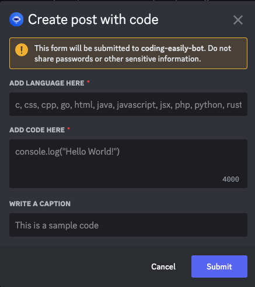

# Instagram Coding Easily API

- [x] Automatically generate post with OpenAI and upload to Instagram (random language, topic, or set manually)
- [x] Upload posts with embed codes to Instagram
- [x] Set up posts with images & captions and upload them to Instagram
- [x] Integrate with Discord Bot
- [x] Automatically generate posts and upload them to Instagram at intervals.

Check more the generated posts at Instagram page [coding.easily](https://www.instagram.com/coding.easily/)

## Demo

### Random generated post in C language


### Discord Bot Commands


### Discord Bot Interactions


### Generate random post with OpenAI
[](https://github.com/harrylowkey/instagram-coding-easily-api/assets/39021290/ec4e4d0a-0593-4291-87aa-583fec7262b1)

### Create post with image and caption
[](https://github.com/harrylowkey/instagram-coding-easily-api/assets/39021290/f7054bd2-3823-4d01-a774-58eb51d269b3)

### Create post with embed code
[](https://github.com/harrylowkey/instagram-coding-easily-api/assets/39021290/053d0050-716c-4450-a483-050596d99da6)


## Setup

- Facebook Developer App
- Instagram Page
- Facebook Page to get access token
- AWS S3 Bucket to upload image
- OpenAI to generate posts
- Discord Server

### Create Facebook Developer App
- App type: Business

- FACEBOOK_ACCESS_TOKEN: We should use Long-Lived User Access Token because it never expires.
[Read more here](https://developers.facebook.com/docs/facebook-login/guides/access-tokens/get-long-lived#long-lived-page-token)

The documents said it must be Long-Live Page Access Token that is now wrong - expired time is only 2 hours

- Shorted-Lived access token: 1 hour
- Page Long-Lived access token: 2 hours
- User Long-Lived access token: never expired

## Installation

```bash
$ pnpm install
```

## Copy secret env
```bash
cp .env.example .env
```

We need these env to start the app
```bash
FACEBOOK_ACCESS_TOKEN=
INSTAGRAM_ACCOUNT_ID=

AWS_S3_BUCKET_NAME=
AWS_ACCESS_KEY_ID=
AWS_SECRET_ACCESS_KEY=
AWS_REGION=

OPENAPI_API_KEY=

DISCORD_APP_ID=
DISCORD_TOKEN=
DISCORD_PUBLIC_KEY=
DISCORD_CHANNEL_ID=
DISCORD_BUG_REPORT_CHANNEL_ID=
```

## Update the run scripts

Add the copy-code2image-public script in `package.json` to copy the code2image public director to your build folder.
Update the build/start:dev/start:debug script to use the copy-code2image-public script.

```json
"scripts": {
    "copy-code2image-public": "mkdirp dist/public && ncp node_modules/@harrylowkey/code2image/public dist/public",
    "build": "npm run copy-code2image-public && nest build",
    "start:dev": "npm run copy-code2image-public && nest start --watch",
    "start:debug": "npm run copy-code2image-public && nest start --debug --watch",
}
```


## Running the app

```bash
# development
$ pnpm run start

# watch mode
$ pnpm run start:dev

# production mode
$ pnpm run start:prod
```
